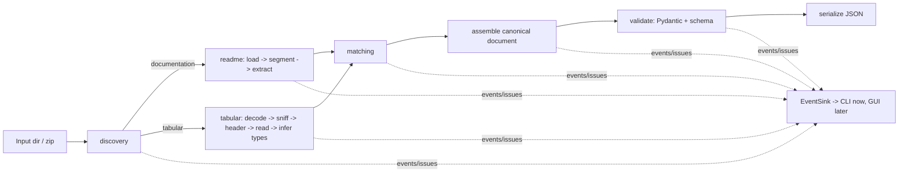

# Research Repository → Standardized JSON: Backend Technical Design

Status: implemented (this document is the design of record)
Schema version: `1.0.0`
Date: 2026-10-03

---

## 0. Judging rubric → design mapping

The 2026 GEC rubric (page 7) scores five areas. Every section below traces back to one of these.

| Rubric criterion | How the backend answers it |
|---|---|
| Readability: comments, logical structure, no deep nesting | Small single-purpose modules (§9). Early returns over nested `if`s. Comments only explain *why* (heuristic thresholds, cited algorithms). Every heuristic constant lives in `config.py` with a one-line rationale. |
| Flexible code: user inputs, no hard-coding, CSV/Excel/TAB/README.md | Input path, output path, thresholds, missing-value tokens, record limits are CLI/TOML inputs (§10). Parser registry covers CSV, TSV, TAB, TXT-delimited, XLSX, XLS, XLSM, XLSB, ODS (§12). README parser handles `.md`, `.txt`, `.pdf`, `.docx` (§11). Nothing references the sample datasets by name. |
| Code structure: functions/modules, multiple files, clear purpose | One package, ~20 files, each with a one-sentence purpose listed in §9. |
| Output and presentation (GUI = 5 pts) | Backend returns a validated Pydantic document and streams typed events, so a GUI can call it in-process and show live stages (§19). The frontend itself is deliberately out of scope for now. |
| Error handling: users know what went wrong | Every problem becomes an `Issue` with severity, a plain-language message, a technical detail, the file/line/sheet location, and a suggested fix (§18). One bad file never stops the run. |

---

## 1. Problem interpretation

A research deposit is a small, badly-linked database: data tables in several formats, plus prose documentation that is the *only* place where column meanings, units, codes and context live. The task is to rebuild those links automatically and emit one predictable JSON document.

Observations from the two provided Borealis repositories (downloaded to `samples/`), which shape the design but are **not** hard-coded:

| Observation | Generalized requirement |
|---|---|
| Data files are Dataverse-ingested `.tab` (UTF-8 with BOM, strings quoted), while READMEs refer to the original `.csv` names. | Link README file references to data files by name stem, not exact filename. Dataverse converts uploaded tabular files to TAB-delimited archival copies [16]. |
| `100A_README.txt` is Windows-1252; the pig READMEs are UTF-8. Both use CRLF. | Encoding must be detected per file, never assumed. |
| Dairy README: numbered fields (`1. Title of dataset:`), `-` separator lines as section rules, `Name:` / `Description:` / `Notes:` variable blocks, stray wrapping quotes from a spreadsheet export (`" Description: ..."`, curly `”`). | README parsing must be layout-tolerant and strip quoting noise. |
| Pig READMEs: ALL-CAPS section headings, `Key: value` lines, variables as `Name, description, unit` lines. | Several variable-list layouts must be recognized. |
| Name drift: `Date`/`date`, `HP_GreenFeed`/`HP_Greenfeed`, `Sr`/`SR`, `BWsmooth_chg`/`BWsmth_chg`, `Name:MEI` (no space). | Multi-stage matching with confidence (§14). |
| Biogeochem README declares 14 variables, lists 15, and lists `FRESH` which is not in the data. | Cross-check declared counts against observed counts; report documented-but-absent variables instead of forcing a match. |
| Biolog README lists `Phase, Distance`; data order is `Distance, Phase`. | Order is evidence, not truth. |
| Both pig datasets share `Pig`, `Phase`, `Distance`. | Detect cross-dataset relationships (candidate join keys). |
| Both READMEs follow the Cornell "readme-style metadata" template [15], which Canadian library guides also recommend [21]. | Use the template's section vocabulary as soft hints, but never require it. |

## 2. What the system must accomplish

1. Safely enumerate a directory or `.zip` and classify every file as `documentation`, `tabular`, or `other`.
2. Decode text robustly and segment documentation into sections, key/value fields, lists and tables, with line numbers.
3. Extract project metadata and variable definitions, scoped to the data file they describe.
4. Detect each table's physical structure (encoding, delimiter, quoting, header row, sheet) and read it into columns.
5. Infer logical column types after applying missing-value codes.
6. Match documented variables to columns, with a confidence score, method, evidence and alternatives.
7. Assemble one canonical document, validate it against a versioned JSON Schema, and serialize it deterministically.
8. Emit structured progress events and categorized issues throughout.

## 3. Hidden-test and generalization strategy

DECISION: Treat the two samples as one data point. Build for README layout variety, format variety and failure tolerance.

WHY: Judges will use unseen repositories. Systems tuned to the samples fail on the first unfamiliar layout.

Tactics:

- **Column-anchored extraction.** The dataset's own column names are the strongest clue to where definitions are. After structural parsing, the extractor also scans every README line for one that *starts with* a token matching a known column. That finds definitions in layouts we never anticipated. This is instance-level evidence in Rahm and Bernstein's terms [12].
- **Several independent layout recognizers** (block, delimited line, pipe table, aligned table, docx table, dictionary sheet). The recognizer that explains the most lines in a section wins, and its name is recorded in provenance.
- **Data dictionaries as documentation.** A CSV or Excel sheet whose header looks like `variable | description | units` is parsed as a source of definitions, not as data. Many repositories ship a codebook sheet instead of a prose README.
- **Never drop information.** README key/values that don't map to a canonical field go to `project.additional_fields`. Unparsed sections are kept as text with line ranges.
- **Never silently guess.** Every inferred value carries provenance and, where heuristic, a confidence.
- **Mutation fixtures** (§21). The test suite mutates the real samples (case changes, delimiter swaps, Windows-1252 re-encoding, preamble rows, conversion to multi-sheet XLSX, renamed columns, README reformatted as Markdown) and asserts the output stays equivalent.

## 4. Language comparison (for this workload)

| Criterion | Python 3.12+ | Rust | Go | Java | Python + custom Rust |
|---|---|---|---|---|---|
| CSV speed | Native via Polars (Rust) | Native | Good (`encoding/csv`, single-threaded) | Good | Same as Python |
| Excel (.xls + .xlsx + .ods) | fastexcel → calamine (Rust) | calamine directly | excelize (no .xls) | Apache POI (heavy, slow) | Same as Python |
| Fuzzy matching | RapidFuzz (C++) | strsim | Few mature libs | Commons Text | Same |
| Messy text heuristics (README) | Fastest to write and change | Verbose | Moderate | Verbose | Python |
| Dev speed under competition deadline | Highest | Lowest | Medium | Low | Low (two toolchains) |
| Explaining to judges | Easiest | Hard | Medium | Medium | Hard |
| Parallelism | Native libs release the GIL; threads suffice | Excellent | Excellent | Excellent | Excellent |
| Toolchain on this machine | Installed (uv, 3.13) | Not installed | n/a | n/a | Not installed |

**Measured on this machine** (Apple M1, 8 GB RAM; each run in a fresh process, best of 3; scripts committed under `benchmarks/`):

| Task | Result |
|---|---|
| 125 MB CSV, 2M rows × 10 cols | Polars `read_csv` **0.144 s / 423 MB peak**; Polars all-string 0.147 s; pandas (pyarrow engine) 0.361 s; DuckDB → Polars 0.436 s / 717 MB; pandas (C engine) 1.356 s |
| Count rows lazily | Polars `scan_csv` 0.072 s / 176 MB |
| 100k-row XLSX | fastexcel **0.416 s**; openpyxl read-only 2.151 s; pandas + openpyxl 3.034 s |
| 500 × 500 name matrix | RapidFuzz `cdist(ratio)` **127 ms**, top-1 500/500; difflib 3,769 ms, top-1 500/500 |
| Vectorized cast of 3M strings to float | Polars 55 ms |

DECISION: **Python 3.12+ (developed on 3.13), no custom Rust.**

WHY: Every hot path (CSV parse, Excel decode, string similarity, JSON validation and serialization) already runs in Rust or C++ inside a mature library. The code we own is decision logic that runs over hundreds of names, and it takes milliseconds.

ALTERNATIVES: Pure Rust; Python with a PyO3/maturin extension.

TRADE-OFF: We give up a few percent of theoretical throughput and a static type system. We gain development speed, a single toolchain, and code a judge can read. We revisit only if a profile shows a Python loop dominating, and so far none does.

## 5. Recommended language

Python, `requires-python >= 3.12`, managed with `uv` and a lockfile with exact pins.

## 6. Technology stack

| Concern | Choice | Status |
|---|---|---|
| Tabular engine | Polars | core |
| Excel reading | fastexcel (calamine) | core |
| Fuzzy matching | RapidFuzz | core |
| Canonical models, validation, JSON | Pydantic v2 | core |
| Encoding detection (fallback rung only) | chardet 7 | core |
| PDF README text | pypdf | core |
| DOCX README text and tables | python-docx | core |
| Tests | pytest | dev |
| Independent schema check in tests | jsonschema | dev |
| Delimiter/header sniffing, README parsing, CLI, logging, zip, config | Python standard library + our code | — |

Deliberately **not** used: pandas (slower, more memory, redundant with Polars), DuckDB (see §7), openpyxl (5× slower and unneeded), sentence-transformers or torch (GB-scale install for a marginal gain, see §14), LLM SDKs (optional later), structlog, Typer and Rich (stdlib is enough for a backend).

## 7. Research supporting each major library

### Polars [1][2]
- What: Rust columnar DataFrame engine built on Arrow, with eager and lazy/streaming APIs.
- Why we need it: Fast, multi-threaded CSV/TSV reading plus vectorized expressions for type inference and column profiling in one pass.
- Better than: pandas (2.5–9× slower here, more memory) and DuckDB (3× slower to materialize, 1.7× memory in our test; DuckDB is excellent for SQL, but we have no queries to run).
- Performance: measured above. `scan_csv` lets very large files be profiled without full materialization.
- Maturity: MIT licence, very active, 1.x stable API.
- Complexity: low; one dependency serves reading and profiling.
- Caveat we design around: Polars expects RFC 4180-conformant input [2][13]. On an unbalanced quote it raised `ComputeError`, and on preamble notes it read the first line as the header. It does no delimiter detection: a semicolon file came back as one column. So **we sniff structure ourselves and pass explicit parameters** (§12), with a fallback ladder.

### fastexcel / calamine [3][4]
- What: Python bindings to calamine, a pure-Rust reader for xlsx/xlsm/xlsb/xls/ods. It produces Arrow data that Polars takes without copying [1].
- Why: Excel support is a stated requirement. It's the reader Polars recommends as fastest [1], and it was 5× faster than openpyxl here.
- Useful properties verified locally: `header_row=None` returns the raw grid, so our own header detection works; `sheet.visible` reports `visible`/`hidden`/`veryhidden`; `dtypes="string"` is available.
- Security property: calamine reads cached formula results and never evaluates formulas or macros. Verified: a formula written without a cached value came back as `0`, and we flag that case.
- Limitation: no merged-cell API. Merged title rows show up as one value plus blanks, which header detection already treats as "not a header".
- MIT licence.

### RapidFuzz [5]
- What: C++ string-similarity library (Indel ratio, Levenshtein, Jaro-Winkler, token scorers) with a vectorized `process.cdist`.
- Why: 30× faster than difflib at identical top-1 accuracy here; MIT-licensed (FuzzyWuzzy is GPL).
- Scorer choice was measured, not assumed:
  - `token_sort_ratio` dropped to 418/500 on reordered names.
  - Jaro-Winkler scored `milk_prt`↔`milk_fat` at 88.6, a dangerous false positive caused by its prefix bonus [24].
  - Indel `ratio` gave 71.4 for that pair and 90.0 for the true pair `BWsmooth_chg`↔`BWsmth_chg`.
  - **Decision: `fuzz.ratio` on normalized names as the primary lexical score; `token_set_ratio` only as secondary evidence for reordered multi-word names.**

### Pydantic v2 [6]
- What: data models with a Rust validation core; emits JSON Schema Draft 2020-12.
- Why: one source of truth for the canonical schema. Models validate on construction, `model_json_schema()` generates the published schema file, and `model_dump_json()` serializes quickly and deterministically.
- Alternatives: dataclasses + jsonschema (two definitions to keep in sync); msgspec (fast but less familiar, weaker JSON Schema tooling).
- MIT licence.

### chardet 7 [7] (with charset-normalizer [8] considered)
- What: encoding detector; 0BSD licence; zero dependencies.
- Measured caveat: on short Western-European samples both detectors were unreliable. chardet guessed Windows-1250 at confidence 0.05; charset-normalizer guessed cp775 or cp932. **So the detector is only one rung of a deterministic ladder, gated by a confidence threshold** (§10).
- Why chardet over charset-normalizer: higher published accuracy (99.7% vs 86.6% on its 3,138-file suite [7]), correct Windows-1251 detection in our test, and streaming support.
- Licence note: chardet 7 is a 2026 ground-up rewrite released as 0BSD [7]. It sits behind one function (`decode_bytes`), so swapping in charset-normalizer is a one-line change if the team prefers.

### pypdf and python-docx
- Why: READMEs and codebooks in Borealis deposits are often PDF or Word. Both are small and pure-Python (BSD-3 / MIT). pypdf's `extraction_mode="layout"` keeps column alignment [9], so aligned variable tables stay parseable. python-docx exposes Word tables directly as rows.
- Rejected: PyMuPDF (better extraction, but AGPL licence).

### Our own structure sniffer instead of csv.Sniffer, DuckDB or CleverCSV
- `csv.Sniffer` failed outright on the preamble and ragged-row fixtures.
- DuckDB's sniffer [10] got delimiters right, but **silently returned 0 rows** for a Windows-1252 file under `ignore_errors`, and with `null_padding` it took preamble notes as the header.
- The algorithm we adopt is the published consistency idea behind both DuckDB and CleverCSV [10][11][25]: parse a sample under each candidate dialect, then pick the one that yields the most columns with the most consistent row lengths. It's ~60 lines of our own code on top of the stdlib `csv` module, fully explainable, and it feeds explicit parameters to Polars.
- CleverCSV was evaluated but not adopted: extra dependency, a C extension, and we only need its core scoring idea.

## 8. Architecture



Principles:
- **Pure stages, one orchestrator.** Each stage is a function: `inputs -> (result, issues)`. Only `pipeline.py` knows the order. Stages never print and never raise for bad *data*; they return issues. They raise only for programming errors.
- **Adapters for formats.** A `TableReader` protocol plus a registry keyed by extension and sniffed content. Adding Parquet, SPSS or Stata means one new file plus one registry line.
- **Documentation before matching.** All documentation is parsed first, so per-file definitions are available when each table is matched.

## 9. File / folder structure

```
GEC-Project/
├── pyproject.toml            # deps (exact pins), entry point, pytest config
├── README.md                 # usage, design summary, IEEE references
├── docs/
│   ├── DESIGN.md             # this document
│   └── SOURCES.md            # running log of external sources (feeds the README references)
├── schemas/
│   └── research_repository.schema.json   # generated from Pydantic, committed
├── samples/                  # the two Borealis repositories (golden tests)
├── src/research_normalizer/
│   ├── __init__.py           # public API: run_pipeline()
│   ├── config.py             # every threshold, limit and token list, with rationale
│   ├── cli.py                # argparse entry point; prints events and summary
│   ├── pipeline.py           # orchestrates stages, emits events, collects issues
│   ├── events.py             # Stage enum, PipelineEvent, EventSink + console/JSONL/list sinks
│   ├── issues.py             # Severity, IssueCode catalogue, Issue model, message templates
│   ├── discovery.py          # safe walk + zip extraction, file classification, hashing
│   ├── text_decoding.py      # BOM -> UTF-8 -> chardet -> cp1252 -> latin-1 ladder
│   ├── schema/
│   │   ├── provenance.py     # Source / Provenance models shared by all outputs
│   │   └── document.py       # canonical output models (RepositoryDocument ...)
│   ├── readme/
│   │   ├── loaders.py        # .md/.txt/.pdf/.docx -> lines (+ docx tables)
│   │   ├── segmenter.py      # lines -> sections, key/values, lists, tables (with line spans)
│   │   ├── project_fields.py # map key/values to project metadata (title, people, licence ...)
│   │   ├── variable_layouts.py   # recognizers: block, delimited-line, pipe, aligned, dictionary
│   │   └── abbreviations.py  # "Long Form (LF)" definitions (Schwartz-Hearst)
│   ├── tabular/
│   │   ├── base.py           # TableReader protocol, RawTable, registry
│   │   ├── dialect.py        # delimiter/quote sniffing by row-length consistency
│   │   ├── delimited.py      # CSV/TSV/TAB reader (Polars + fallback ladder)
│   │   ├── excel.py          # fastexcel reader: per-sheet, visibility, raw grid
│   │   ├── header_detection.py   # choose header row; multi-row headers; blank/dup names
│   │   ├── type_inference.py # missing-value application + Frictionless type inference
│   │   └── profiling.py      # one-pass Polars column statistics
│   ├── matching/
│   │   ├── normalize.py      # name normalization and tokenization
│   │   ├── scorers.py        # one function per stage, each returns (score, evidence)
│   │   └── assign.py         # candidate matrix -> one-to-one assignment + ambiguity
│   ├── linking.py            # README sections <-> data files (name-stem matching)
│   └── assemble.py           # builds RepositoryDocument from stage results
├── tests/
│   ├── fixtures/builders.py  # code-generated synthetic repositories + sample mutations
│   ├── unit/...              # one test module per source module
│   └── integration/...       # repository -> JSON, golden files for samples
└── benchmarks/
    ├── bench_readers.py      # the reader comparison above, reproducible
    ├── bench_matching.py
    └── bench_pipeline.py     # end-to-end time and peak RSS on synthetic repos
```

No empty modules: anything not needed in the first implementation (an LLM resolver, an HTTP server) is left out until it is needed.

## 10. Data ingestion strategy

**Discovery** (`discovery.py`)
1. Resolve the input path. If it's a `.zip`, extract it safely into a `TemporaryDirectory` (§23).
2. Walk with `os.scandir`, not following symlinks, skipping hidden/system files (`.DS_Store`, `__MACOSX`, `Thumbs.db`), and enforcing `max_files` and `max_file_bytes`.
3. Classify each file by extension, then confirm by content sniffing (magic bytes: `PK\x03\x04` for xlsx/zip, `D0 CF 11 E0` for xls; text otherwise).
4. Documentation candidates: names matching `readme`, `read_me`, `codebook`, `data_dictionary`, `metadata`, `methods`, `manifest`, plus any `.md`, `.txt`, `.pdf`, `.docx` that isn't tabular. Each candidate is scored, and filenames containing "readme" rank highest.
5. **Multiple READMEs are normal.** Each one is linked to the data files it names (§11). Unlinked READMEs apply repository-wide.
6. A `.txt` file is tried as a table first. If the dialect sniffer finds a consistent multi-column structure it is data; otherwise it is documentation.
7. Unsupported files are listed in `files[]` with role `other` and an INFO issue. Nothing is silently ignored.
8. Record per file: relative path, size, SHA-256 (for provenance and deduplication; ingest-time cost is negligible), detected format and role.

**Text decoding ladder** (`text_decoding.py`), deterministic and recorded in output:
1. BOM present → UTF-8-SIG / UTF-16 / UTF-32.
2. Strict UTF-8 decode of the full text sample succeeds → UTF-8.
3. chardet on up to 1 MB; accept if confidence ≥ `config.encoding_min_confidence` (0.80).
4. Strict cp1252 succeeds → cp1252. This is the most common legacy encoding for Canadian English/French data, and it is what `100A_README.txt` uses.
5. latin-1, which never fails. Emit a WARNING with the byte offsets of suspicious characters.

**Configuration** (`config.py`): a frozen dataclass `PipelineConfig`. Values come from defaults → optional `--config file.toml` (stdlib `tomllib`) → CLI flags. Examples: `missing_value_tokens`, `match_accept_threshold`, `match_review_threshold`, `ambiguity_margin`, `max_records_per_dataset`, `header_scan_rows`, `max_file_bytes`, `max_zip_members`.

## 11. README parsing strategy

**Loading** (`readme/loaders.py`): `.md`/`.txt`/unknown text → decoded lines. `.pdf` → pypdf layout text per page, prefixed `[page N]` for provenance. `.docx` → paragraphs (heading styles become headings) and tables (rows of cells).

**Segmentation** (`readme/segmenter.py`) turns lines into a list of `Block`s (`heading`, `key_value`, `list_item`, `table_row`, `rule`, `text`), each with `line_start`/`line_end`. Cleaning first:
- Strip wrapping quotes and curly-quote debris (`" Description: x"` → `Description: x`, trailing `”`).
- Normalize Unicode with NFKC.
- Strip trailing whitespace.

Heading detection rules, each cited or justified:

| Rule | Example |
|---|---|
| Markdown ATX/Setext headings (CommonMark [22]) | `## Variables`, text underlined with `===` |
| ALL-CAPS line of ≤ 8 words with no terminal period | `METHODOLOGICAL INFORMATION` |
| Short line between rule lines (`-`, `—`, `***`) | dairy README `-` / `General information` / `-` |
| Short title-case line followed by key/values, or a line ending with `:` that has no value | `Variable List:` |
| Template prompts in angle brackets are dropped | `<provide at least two contacts>` |

Key/value lines: `^\s*(\d+[.)]\s*)?(?P<key>[^:]{1,60}):\s*(?P<value>.*)$`, with a guard so URLs and times don't split. A value continues onto following lines until the next key/heading/rule (dairy "Links to publications…" spans two lines).

**Project fields** (`readme/project_fields.py`): keys are matched to canonical fields with the same normalized + fuzzy matcher used for variables, against a small synonym table aligned with DataCite properties [17] and the Cornell template [15]:

| Canonical field | Example README keys |
|---|---|
| `title` | Title of dataset, Dataset title, Title |
| `description` | Description of the dataset, Abstract, Summary |
| `creators` / `contacts` | Authors, Principal Investigator, Co-investigator, Long-term contact |
| `identifier` | Dataset DOI, DOI |
| `collection_period` | Date of data collection |
| `geographic_location` | Geographic location … |
| `funding` | Funding information, Information about funding sources … |
| `license` | Licenses/restrictions … |
| `related_publications`, `related_datasets` | Links to publications …, Links/relationships to ancillary data sets |
| `citation` | Recommended citation, Dataset citation |
| `methodology` | sections or keys containing method/methodology/protocol/QA/instrument |
| `readme_generated_on` | "This readme file was generated on YYYY-MM-DD by …" |

**People** are parsed from repeated `Name/ORCID/Institution/Email/Address` groups. A new `Name:` starts a new person. The role comes from the nearest preceding heading or key (e.g. "Principal Investigator", "Co-investigator", "Authors", "Long-term contact"). ORCIDs are validated with the ISO 7064 mod 11-2 checksum; emails with a simple pattern.

**Scoping and linking** (`linking.py`): a section whose heading or key contains a filename (e.g. `DATA-SPECIFIC INFORMATION FOR: X.csv`, a "File List" entry) is bound to the data file whose **name stem** matches: exact → case-insensitive → fuzzy ≥ 90. That is how `X.csv` in the README links to Dataverse's `X.tab`. Definitions inside a bound section apply only to that file; everything else is repository-wide.

**Variable definitions** (`readme/variable_layouts.py`): each recognizer reports how many lines of a section it explains, and the best one wins.
1. **Block layout:** `Name: X` followed by `Description:` / `Units:` / `Value labels:` / `Notes:` / `Type:` lines (dairy).
2. **Delimited line:** `X<sep>description[<sep>unit]` where sep ∈ {`,`, ` - `, ` – `, `:`, `=`, tab} (pig). A trailing segment is treated as a unit when it is short and unit-like (contains `/`, `%`, `^`, `-1`, or a known SI/common unit token), *or* when the description contains `in <unit>`.
3. **Pipe table** (GFM tables [22]) or **aligned table** (≥ 2 spaces between columns, typical of PDFs). The header row identifies name/description/unit/values columns by synonyms.
4. **DOCX table** and **dictionary sheet/CSV** (§3) use the same header-synonym logic as 3.
5. **Column-anchored scan:** any line whose first token matches a known column name, as a fallback.

Value labels: `1 = Male, 2 = Female`, `0: no; 1: yes`, `M - male` → `[{code, label}]`.
Missing codes: keys like "Missing data codes" are bound to file scope or global scope; their values are split on `,`/`;`/`or`/whitespace (`.` → `["."]`, `NA` → `["NA"]`).
Declared counts: "Number of variables/cases/rows" are kept for cross-checking (§13).
Abbreviations: `abbreviations.py` implements the Schwartz–Hearst algorithm [23] to harvest `Bacterial abundance (BA)` style definitions from methodology prose. These feed matching stage 3 as README-local aliases.

## 12. Dataset parsing strategy

Every reader returns the same `RawTable`: `name`, `sheet`, `grid` (list of string rows for the first `header_scan_rows`), a Polars `DataFrame` of strings, `dialect` and `issues`.

**Delimited files** (`tabular/dialect.py`, `tabular/delimited.py`):
1. Decode a sample (first 64 KB cut at a line boundary) with the decoding ladder.
2. Sniff the dialect. For each delimiter in `, \t ; |` and quote in `" ' none`, parse the sample with stdlib `csv`. Score = modal field count × fraction of rows with that count; ties go to the more common dialect. Rows before the first run of ≥ 3 consistent rows count as "preamble" and are excluded from the score (DuckDB and CleverCSV idea [10][11]). `.tab`/`.tsv` give a prior toward tab, never a guarantee.
3. Detect the header on the parsed sample grid (below).
4. Bulk read with Polars using the explicit `separator`, `quote_char`, `skip_rows`, and `infer_schema=False` (all strings, so we control typing and missing codes). Polars removes the UTF-8 BOM. For non-UTF-8 files, decoded text is re-encoded as UTF-8 bytes before reading.
5. Fallback ladder on `ComputeError`: (a) `quote_char=None` with a WARNING `CSV_QUOTE_FALLBACK` (verified: the unbalanced-quote fixture then parses with the quote kept as a literal); (b) stdlib `csv` row-by-row with ragged-row repair. Every rung taken is recorded.
6. Ragged rows: counted in the sample; read with `truncate_ragged_lines=True`; WARNING with row numbers when extra fields would be lost.

**Excel** (`tabular/excel.py`): every sheet is opened with `header_row=None, dtypes="string"`.
- Empty sheets → INFO and skipped.
- Hidden or very-hidden sheets → processed and flagged (configurable).
- Each non-empty sheet becomes its own dataset with `worksheet_name`.
- A sheet that looks like a data dictionary is routed to documentation.
- Corrupt or encrypted workbooks → ERROR for that file; the run continues.
- `.xls` (BIFF) is supported by calamine.

**Header detection** (`tabular/header_detection.py`): this solves blank rows before the header, title rows, multiple candidate header rows, and the Excel merged-title case. In the spirit of Pytheas [26], each of the first `header_scan_rows` (30) non-empty rows is scored:
- `+` fill ratio vs. the table's modal width
- `+` share of non-numeric, non-date cells
- `+` uniqueness of cell values
- `+` type contrast: rows below are more numeric/date-like than this row
- `+` overlap with documented variable names (instance evidence from the README)
- `−` single-cell rows (titles, notes)
- `−` rows that look like units, e.g. `(kg)`, `[mg/L]`, which are attached to the header as units instead

The highest score wins.
- If no row clears `config.header_min_score`: generate `column_1…n` and raise a WARNING.
- If two rows score within the margin: choose the earlier one, mark the decision `ambiguous` in provenance, and raise a WARNING.
- A sparse text row directly above the header (merged group labels) is combined as `group / name`, with a WARNING.

Header hygiene:
- Blank names become `column_<n>` (WARNING).
- Duplicates become `name__2`, `name__3`, keeping `original_name` (WARNING).
- Surrounding whitespace is stripped. The original text is always kept.

## 13. Schema inference strategy

Order follows Frictionless Table Schema [14]: **missing values are applied to the physical strings before any type casting.**

1. Missing tokens = config defaults (`""`, `NA`, `N/A`, `NaN`, `null`, `NULL`, `None`, `-`) ∪ README-declared codes for this file. Each token's origin is recorded.
2. Numeric sentinels (`-9`, `-99`, `-999`, `-9999`) are **never** treated as missing unless the README declares them. If one makes up a suspicious share of a numeric column, raise WARNING `POSSIBLE_UNDECLARED_MISSING_CODE`.
3. Type candidates, most specific first, implemented as vectorized Polars `cast(strict=False)` / `str.to_date` checks: `boolean` → `integer` → `number` → `date` → `datetime` → `time` → `string`.
4. A type is accepted only if **100% of non-missing values** cast. Otherwise the column stays `string`, and the failing examples (≤ 5, with row numbers) go into an INFO issue. Values are never coerced lossily.
5. Integers with leading zeros (`007`) stay `string` (identifier rule).
6. `boolean` only from true/false/yes/no tokens. `0/1` stays `integer`.
7. Dates are accepted only for unambiguous formats. If `dd/mm` and `mm/dd` both fit every value, the column stays `string` with WARNING `AMBIGUOUS_DATE_FORMAT`.
8. Scientific notation (`9.16E+06`) → `number`.
9. Every column gets a `role` hint: `identifier` (unique, string/int), `categorical` (≤ `categorical_max_distinct` values), `measure`, `temporal`, `text`.
10. Cross-checks against the README:
    - Declared variable count vs. observed column count.
    - Declared row count vs. observed rows.
    - A documented unit or value labels on a column that came out `string` → WARNING.

**Profiling** (`tabular/profiling.py`): one Polars `select` per table computes, per column:
- count, null count, count per missing token, distinct count
- min / max / mean / std for numbers
- min / max for dates
- top-10 values for categoricals

Planned, not implemented in v1: for very large tables, run the same expressions on `scan_csv(...)` with streaming. Today every table is read eagerly, bounded by `max_file_bytes`.

## 14. Variable matching algorithm

Inputs: the columns of one table, and the definitions in scope (file-bound first, then global). Output: one `VariableMatch` per column and a list of documented-but-absent variables.

Every stage is a pure function `(column, definition, context) → (score ∈ [0,1], evidence)`. Earlier stages short-circuit later ones.

| Stage | Method | Base score | Example from samples |
|---|---|---|---|
| 1 | Exact string | 1.00 | `CowID` = `CowID` |
| 2a | Case-insensitive | 0.98 | `Date` ↔ `date`, `Sr` ↔ `SR`, `HP_GreenFeed` ↔ `HP_Greenfeed` |
| 2b | Normalized: NFKC, lowercase, strip accents, `[_\-\s.]` removed, unit suffix in brackets removed | 0.95 | `milk-fat` ↔ `milk_fat` |
| 3 | Token alias: per-token equal, *or* one token is an ordered-subsequence abbreviation of the other (same first letter, length ≥ 2), *or* a README-declared abbreviation (Schwartz-Hearst [23]) | 0.90 | `BWsmooth_chg` ↔ `BWsmth_chg` (`smth` ⊂ `smooth`) |
| 4 | Lexical fuzzy: RapidFuzz Indel `ratio` on normalized names, with `score_cutoff=70` | ratio/100 × 0.90 | `BWsmooth_chg` ↔ `BWsmth_chg` = 90.0 |
| 5 | Contextual adjustments (added to the best of 1–4, capped at 1.0) | ±0.00–0.08 | see below |
| 6 | Optional resolver hook (LLM or human), **off by default** | — | only for remaining ambiguous items |

Stage 5 is instance- and structure-level evidence, following Rahm and Bernstein's taxonomy of combined matchers [12]:
- `+0.03` same ordinal position as in the README list (±1)
- `+0.03` documented value-label codes ⊆ observed distinct values
- `+0.02` documented unit consistent with the inferred type (unit ⇒ numeric)
- `−0.05` documented value labels but observed values disjoint
- `−0.03` documented as categorical but column is high-cardinality free text

**Assignment** (`matching/assign.py`):
1. Build the full score matrix with `rapidfuzz.process.cdist` for stage 4 (vectorized) plus exact/normalized/alias lookups through dictionaries.
2. Greedy one-to-one assignment in descending score, with a deterministic tie-break (score, then column position, then README order). This is why `BW_smooth` (exact) is consumed before `BWsmooth_chg` can steal it: their fuzzy score is 84.2, close to the true pair's 90.0.
3. **Ambiguity:** if a column's best and second-best *unassigned* candidates are within `ambiguity_margin` (0.05) and context doesn't separate them, the match is marked `ambiguous` and listed with `alternatives`. It is assigned only if above the accept threshold, and always with a WARNING.
4. Decision bands:
   - ≥ 0.85 accepted
   - 0.70–0.85 accepted, with WARNING `MATCH_LOW_CONFIDENCE`
   - < 0.70 unmatched; top-3 candidates are still reported
5. Leftovers:
   - Columns with no definition → `VARIABLE_UNDOCUMENTED` (WARNING).
   - Definitions with no column → `unmatched_documented_variables` plus `DOCUMENTED_VARIABLE_NOT_IN_DATA` (`FRESH` in the Biogeochem sample).

DECISION: greedy assignment with explicit ambiguity flags.
ALTERNATIVES: Hungarian algorithm (needs SciPy; optimizes a global sum that judges can't easily follow); embeddings.
TRADE-OFF: greedy can be sub-optimal in rare dense conflicts, but those are exactly the cases we flag as ambiguous.

DECISION: no embedding model in v1.
WHY: Column names are short codes (`DIM`, `pC3`). Embedding models are trained on prose and add 100 MB–2 GB of dependencies. Descriptions are already used deterministically through abbreviations and value labels.
TRADE-OFF: pure synonym pairs (`sex` vs `gender`) are missed. The stage-6 hook exists for these, and we add a model only if the mutation tests show a real gap.

Match record (per variable):
```json
"match": {
  "status": "matched",
  "documented_name": "BWsmooth_chg",
  "confidence": 0.93,
  "method": "token_abbreviation",
  "evidence": ["'smth' is an ordered abbreviation of 'smooth'", "same list position (9)"],
  "alternatives": [{"documented_name": "BW_smooth", "confidence": 0.76}],
  "warning": null
}
```

## 15. Canonical JSON schema (v1.0.0)

Design goals:
- Readable top-down: project → datasets → variables, which mirrors the competition's suggested Project/Dataset tree.
- Field names aligned with Frictionless Table Schema [14] (variables) and DataCite [17] (project), so the format is defensible and interoperable.
- Values stay flat and readable; provenance sits in a parallel `sources` map instead of wrapping every value.

```json
{
  "schema_version": "1.0.0",
  "repository": { "name": "pig_decomposition_hawaii", "file_count": 4 },
  "project": {
    "title": "Biogeochemical evaluation of soils ...",
    "description": null,
    "creators": [{ "name": "Emily Leanna Pecsi", "role": "principal_investigator",
                   "orcid": "0000-0002-6725-3622", "affiliation": "Université du Québec à Trois-Rivières",
                   "email": "emily.pecsi@uqtr.ca" }],
    "contacts": [],
    "identifier": null,
    "collection_period": { "start": "2022-03-30", "end": "2022-04-19", "text": "2022-03-30 to 2022-04-19" },
    "geographic_location": "21.290833 N, -157.804722 W",
    "funding": ["Canada 150 Research Chair in Forensic Thanatology", "..."],
    "license": "Creative Commons Attribution 4.0 International (CC BY 4.0)",
    "related_publications": [], "related_datasets": ["https://doi.org/10.5683/SP3/DEH8FG"],
    "citation": "Pecsi, E.L., ...",
    "methodology": [{ "heading": "Bacterial abundance (BA)", "text": "..." }],
    "additional_fields": [{ "label": "Are there multiple versions of the dataset?", "value": "No" }],
    "sources": { "title": { "file": "..._ReadMe.txt", "section": "GENERAL INFORMATION", "lines": [3, 3], "method": "key_value" } }
  },
  "documents": [
    { "file": "..._ReadMe.txt", "encoding": "utf-8", "describes": ["...Biogeochem....tab"],
      "sections": [{ "title": "GENERAL INFORMATION", "lines": [2, 52] }] }
  ],
  "datasets": [
    {
      "id": "pecsi_hawaii_biogeochem_pigdecomposition",
      "title": "Complete dataset",
      "file": "Pecsi_Hawaii_Biogeochem_PigDecomposition.tab",
      "documented_as": "Pecsi_Hawaii_Biogeochem_PigDecomposition.csv",
      "worksheet_name": null,
      "description": null,
      "format": "tsv",
      "structure": { "encoding": "utf-8-sig", "delimiter": "\t", "quote_char": "\"",
                     "header_row": 1, "header_confidence": 0.97 },
      "row_count": 116, "column_count": 14,
      "declared": { "variable_count": 14, "row_count": 116 },
      "headers": ["Pig", "Phase", "..."],
      "last_updated": { "value": "2026-06-24", "source": "readme_generated_on" },
      "variables": [
        {
          "name": "BR", "original_name": "BR", "position": 5,
          "label": "bacterial respiration", "description": "bacterial respiration",
          "unit": "ugC/gSoil/hour", "type": "number", "format": "default", "role": "measure",
          "missing_values": ["NA", ""],
          "value_labels": [],
          "notes": null,
          "statistics": { "count": 116, "missing": 0, "distinct": 109, "min": 0.21, "max": 12.4, "mean": 3.1 },
          "match": { "status": "matched", "documented_name": "BR", "confidence": 1.0, "method": "exact", "evidence": [], "alternatives": [], "warning": null },
          "sources": { "description": { "file": "..._ReadMe.txt", "section": "DATA-SPECIFIC INFORMATION FOR: ...csv", "lines": [70, 70], "method": "delimited_line" } }
        }
      ],
      "unmatched_documented_variables": [{ "name": "FRESH", "description": "freshness index", "lines": [77, 77] }],
      "records": [{ "Pig": "H1", "Phase": "Fresh", "Distance": "m50", "BA": 9160000.0, "BR": 1.69 }],
      "records_included": 116,
      "records_truncated": false
    }
  ],
  "relationships": [
    { "type": "shared_variables", "datasets": ["...biogeochem...", "...biolog..."], "variables": ["Pig", "Phase", "Distance"], "confidence": 0.9 },
    { "type": "documented_link", "from": "project", "target": "https://doi.org/10.5683/SP3/DEH8FG" }
  ],
  "files": [{ "path": "...", "role": "tabular", "format": "tsv", "size_bytes": 10174, "sha256": "...", "status": "processed" }],
  "issues": [{ "code": "DOCUMENTED_VARIABLE_NOT_IN_DATA", "severity": "warning",
               "message": "The README describes a variable 'FRESH' that does not appear in Pecsi_...Biogeochem....tab.",
               "technical_detail": "No column scored >= 0.70; best candidate 'FI' (0.26).",
               "location": { "file": "..._ReadMe.txt", "lines": [77, 77] },
               "suggestion": "Check whether the column was renamed or removed from the data file." }],
  "summary": { "datasets": 2, "variables": 48, "matched": 47, "undocumented": 1, "warnings": 3, "errors": 0 },
  "processing": { "tool_version": "1.0.0", "started_at": "...", "duration_ms": 312,
                  "stage_durations_ms": { "discovery": 2, "readme_parsing": 9, "...": 0 }, "config": { "...": "..." } }
}
```

Key choices:

- **Variables nested inside their dataset.** They are dataset-specific, and nesting matches the competition tree. Cross-dataset links go in `relationships`.
- **`records` are typed values keyed by header.** Missing codes become `null`. The "100% casts or stays string" rule means no value is ever coerced lossily, and every original cell is recoverable via file + row (provenance).
  - Records are capped at `max_records_per_dataset` (default 50,000; `--all-records` for none). `records_truncated` says so explicitly. This keeps very large datasets from producing multi-GB JSON while still meeting the "records: list[dict]" expectation.
- **Determinism.** Files are sorted and IDs are slugs of relative paths. Only `processing` contains timestamps or durations, and `--deterministic` omits them so golden-file tests compare byte-for-byte.
- **Versioning.** `schema_version` uses SemVer. The JSON Schema file is generated by `python -m research_normalizer.schema` and committed. A test fails if the committed file and the models drift.
- **Excel.** One dataset per sheet. `id` = `<file-slug>__<sheet-slug>`.

## 16. Provenance strategy

Every README-derived value records a `Source`: `file`, `section` (heading text), `lines: [start, end]` (or `page` for PDFs, `table/row` for DOCX), and `method` (the recognizer or stage name). Every data-derived fact records `file`, `sheet`, `header_row`, dialect and encoding with the decoding rung used, and issue locations carry row numbers. Provenance lives in `sources` maps next to the values it explains, and in `issues[].location`, so a future GUI can show the "why" without cluttering the main values.

## 17. Confidence-scoring strategy

Confidence exists only where a decision is heuristic:

| Confidence | How it's computed |
|---|---|
| Variable match | Stage base score + contextual adjustment (§14). |
| Header row | Normalized margin between best and second-best row score. |
| Encoding | 1.0 for BOM or strict UTF-8; the detector's confidence for rung 3; 0.6 for the cp1252 fallback; 0.3 for latin-1. |
| README field mapping | Key-match score (exact synonym 1.0, fuzzy key `ratio`/100). |
| File ↔ README link | Stem match score. |
| Relationship | Shared-name ratio × value-overlap ratio on candidate keys. |

All thresholds sit in `config.py` with a comment. They are tuned only on synthetic and mutation fixtures, never on the two samples alone, and the tuning results are recorded in `benchmarks/`.

## 18. Error-handling strategy

Severity levels:
- `fatal`: no output possible (input missing or unreadable, zero files after discovery). The CLI exits with code 2 and a clear message.
- `error`: one file or sheet could not be processed. It is skipped, its `files[].status` = `failed`, and the run continues (exit code 1 if any).
- `warning`: output produced, but a human should check.
- `info`: notable decisions (fallbacks, skipped empty sheets).

`issues.py` holds a catalogue of codes with templates for both the plain message and the technical message, e.g.: `README_NOT_FOUND`, `README_MULTIPLE`, `ENCODING_FALLBACK`, `UNSUPPORTED_FILE`, `EXCEL_CORRUPT`, `EXCEL_HIDDEN_SHEET`, `EXCEL_FORMULA_NO_CACHED_VALUE`, `CSV_RAGGED_ROWS`, `CSV_QUOTE_FALLBACK`, `HEADER_NOT_FOUND`, `HEADER_AMBIGUOUS`, `HEADER_DUPLICATE`, `HEADER_BLANK`, `DECLARED_COUNT_MISMATCH`, `CONFLICTING_METADATA`, `MATCH_AMBIGUOUS`, `MATCH_LOW_CONFIDENCE`, `VARIABLE_UNDOCUMENTED`, `DOCUMENTED_VARIABLE_NOT_IN_DATA`, `POSSIBLE_UNDECLARED_MISSING_CODE`, `AMBIGUOUS_DATE_FORMAT`, `FILE_TOO_LARGE`, `ZIP_UNSAFE_MEMBER`.

The pipeline wraps each per-file stage in a boundary that converts unexpected library exceptions into an `error` issue carrying the exception type, the message and the stage. The traceback goes to the debug log, never into the JSON.

## 19. Logging and event architecture

`events.py` defines a `Stage` enum (`discovery`, `classification`, `readme_parsing`, `structure_detection`, `variable_matching`, `normalization`, `validation`, `complete`), a `PipelineEvent` model (sequence, stage, status, plain `message`, `technical_message`, `progress` 0–100, `file`, `timestamp`, `data` dict), and an `EventSink` protocol. Sinks: `ConsoleSink` (CLI; technical detail with `-v`), `JsonLinesSink` (`--events events.jsonl`), `ListSink` (tests). Each event is a JSON object, so a later SSE endpoint [19] or WebSocket handler only forwards `event.model_dump_json()`, and a desktop GUI can subscribe to a callback. Issues are also emitted as `warning`/`failed` events as they occur. Developer logging uses the stdlib `logging` module; logs are for developers, events are the user-facing channel.

## 20. Performance strategy

- **Parse each file once.** One decoded sample serves sniffing and header detection. One Polars read. One profiling `select`. Polars and fastexcel hand over data through Arrow without copying [1][3].
- **Read as strings, then cast with vectorized expressions** (55 ms per 3M cells measured). No Python per-cell loops.
- **Large files (planned, not in v1):** stream very large tables with `scan_csv`. Today records are capped by `max_records_per_dataset` and files by `max_file_bytes`, so memory stays bounded.
- **Parallelism (planned, not in v1; files are currently read one after another):** `ThreadPoolExecutor(workers)` across files. Polars, fastexcel and RapidFuzz release the GIL in native code, so threads avoid process-spawn and pickling costs. Results are re-sorted for deterministic output. Within a file Polars is already multi-threaded, so a process pool would oversubscribe the 8-core M1. The worker count is benchmarked, not assumed (§22).
- **Matching:** one `cdist` call per table, plus O(1) dictionary lookups for stages 1–3.
- **Serialization:** Pydantic `model_dump_json()` (Rust) writes straight to file.

## 21. Testing strategy

pytest, with fixtures **generated by code** in `tests/fixtures/builders.py`. Generated fixtures are reviewable and cover all 20 requested scenarios without binary blobs.

| # | Scenario | Fixture / assertion |
|---|---|---|
| 1 | Clean CSV + clean README | all variables matched `exact`, zero warnings |
| 2 | TSV / `.tab` | tab dialect detected, Dataverse-style quoting |
| 3 | Multi-sheet Excel incl. hidden, empty and dictionary sheets | one dataset per data sheet; hidden flagged; dictionary used as definitions |
| 4 | README names differ slightly | `token_abbreviation` / `fuzzy` with expected confidence band |
| 5 | Duplicate columns | `name__2`, `HEADER_DUPLICATE` |
| 6 | Missing definition for a column | `VARIABLE_UNDOCUMENTED` |
| 7 | Column missing from README | same, at dataset level |
| 8 | README variable missing from data | `unmatched_documented_variables` |
| 9 | Capitalization | `case_insensitive` |
| 10 | Hyphen vs underscore | `normalized` |
| 11 | Windows-1252 / UTF-16 / Latin-1 | correct text and recorded rung |
| 12 | Wrong extension (`.csv` that is `;`-delimited) | dialect overrides extension |
| 13 | Metadata scattered across sections | fields collected from several sections with correct sources |
| 14 | One README, several datasets | per-file scoping honoured |
| 15 | Large dataset (generated 1M rows, marked `slow`) | bounded memory, `records_truncated` |
| 16 | Corrupted row / unbalanced quote | fallback rung recorded, other rows intact |
| 17 | Blank rows before header | correct `header_row` |
| 18 | Title row + units row + header | header chosen, units attached |
| 19 | Ambiguous fuzzy match | `ambiguous`, alternatives listed, warning |
| 20 | Unseen structure (nested folders, zip, codebook.docx, README.pdf, no README) | completes with sensible issues |

Plus: **golden tests on the two real samples** (`--deterministic`, byte-for-byte); **mutation tests** (§3); **schema tests** (every document validates against the committed JSON Schema with the independent `jsonschema` validator, and the committed schema equals a freshly generated one); **unit tests per module**.

## 22. Benchmarking strategy

`benchmarks/` holds plain scripts (no extra dependency). Each run happens in a fresh subprocess so peak RSS (`resource.getrusage`) is isolated. Best of N is reported with hardware and library versions.
1. Reader comparison (already run, §4), reproducible.
2. Matching: RapidFuzz scorers vs difflib; accuracy *and* time.
3. Eager vs lazy profiling on 100 MB / 1 GB CSVs.
4. Thread worker count (1, 2, 4, 8) on a 200-file synthetic repository.
5. End-to-end per stage on: the two samples, a 50-file mixed repository, and a 1M-row CSV.

Run `python benchmarks/bench_pipeline.py` and `python benchmarks/bench_matching.py` to reproduce the numbers; only measured numbers appear in the README.

## 23. Security considerations

- **Paths:** every discovered or extracted path is resolved and must stay inside the input root (`Path.resolve().is_relative_to(root)`). Symlinks are not followed. Output filenames are slugified, never taken raw.
- **Zip archives** follow OpenSSF guidance on zip-slip [18] and Python's documented decompression pitfalls [20]: reject absolute paths, `..` components and drive letters; cap member count, total uncompressed bytes and per-member compression ratio; stream-extract with a byte counter rather than trusting header sizes; do not recurse nested zips; extract into a private `TemporaryDirectory` that is always cleaned up.
- **Resource limits:** `max_file_bytes`, `max_files`, `max_pdf_pages`, `header_scan_rows`, record caps.
- **Spreadsheets:** calamine never evaluates formulas or macros. Cell text starting with `= + - @` is kept as plain data. A future GUI must escape all values when rendering HTML (noted for frontend work).
- **No execution:** uploaded content is never `eval`-ed, imported, or passed to a shell. TOML config is parsed with `tomllib` (data only).
- **Future server:** any HTTP endpoint must add authentication, upload size limits and per-request temp isolation. Flagged now, implemented with the frontend.

## 24. External sources (with links)

Listed in §25 in IEEE format. Every library is used through its public API; no third-party source code is copied. The algorithms adapted (dialect consistency scoring, Schwartz-Hearst abbreviations, header-row scoring) are re-implemented from the papers and cited at the implementing function.

## 25. IEEE citation plan and references

Process: `docs/SOURCES.md` keeps a running log during implementation (source, URL, access date, what it influenced, licence). The README's References section is generated from it. Code comments cite as `# Ref [n]`.

Accessed 3 Oct. 2026 unless noted.

[1] Polars Developers, "Excel — Polars user guide." [Online]. Available: https://docs.pola.rs/user-guide/io/excel/
[2] Polars Developers, "polars.read_csv — Polars documentation." [Online]. Available: https://docs.pola.rs/api/python/stable/reference/api/polars.read_csv.html
[3] ToucanToco, "fastexcel: A fast excel reader for Rust and Python," GitHub. [Online]. Available: https://github.com/ToucanToco/fastexcel
[4] J. Tuffé (tafia) et al., "calamine: A pure Rust Excel/OpenDocument SpreadSheets file reader," GitHub. [Online]. Available: https://github.com/tafia/calamine
[5] M. Bachmann, "RapidFuzz documentation," v3.14. [Online]. Available: https://rapidfuzz.github.io/RapidFuzz/
[6] Pydantic Services Inc., "JSON Schema — Pydantic documentation," v2.12. [Online]. Available: https://pydantic.dev/docs/validation/2.12/concepts/json_schema/
[7] D. Blanchard et al., "chardet: Python character encoding detector," GitHub. [Online]. Available: https://github.com/chardet/chardet
[8] A. R. Tahri (jawah), "charset_normalizer," GitHub. [Online]. Available: https://github.com/jawah/charset_normalizer
[9] pypdf Contributors, "Extract Text from a PDF — pypdf documentation." [Online]. Available: https://pypdf.readthedocs.io/en/latest/user/extract-text.html
[10] P. Holanda, "Automatic detection of types and dialects," DuckDB Blog, Oct. 27, 2023. [Online]. Available: https://duckdb.org/2023/10/27/csv-sniffer
[11] G. J. J. van den Burg, A. Nazábal, and C. Sutton, "Wrangling messy CSV files by detecting row and type patterns," *Data Mining and Knowledge Discovery*, vol. 33, no. 6, pp. 1799–1820, 2019, doi: 10.1007/s10618-019-00646-y.
[12] E. Rahm and P. A. Bernstein, "A survey of approaches to automatic schema matching," *The VLDB Journal*, vol. 10, no. 4, pp. 334–350, 2001, doi: 10.1007/s007780100057.
[13] Y. Shafranovich, "Common Format and MIME Type for Comma-Separated Values (CSV) Files," IETF RFC 4180, Oct. 2005. [Online]. Available: https://datatracker.ietf.org/doc/html/rfc4180
[14] P. Walsh and R. Pollock, "Table Schema," Frictionless Data Specifications, v1, 2021. [Online]. Available: https://specs.frictionlessdata.io/table-schema/
[15] Cornell Data Services, "Writing READMEs for research data," Cornell University. [Online]. Available: https://data.research.cornell.edu/content/readme/
[16] The Dataverse Project, "Tabular data, representation, storage and ingest," Dataverse User Guide. [Online]. Available: https://guides.dataverse.org/en/latest/user/tabulardataingest/ingestprocess.html
[17] DataCite Metadata Working Group, "DataCite Metadata Schema for the Publication and Citation of Research Data and Other Research Outputs," v4.6, DataCite e.V., 2024. [Online]. Available: https://schema.datacite.org/
[18] OpenSSF Best Practices Working Group, "pyscg-0012: Excessive unzipping / zip slip," Secure Coding Guide for Python. [Online]. Available: https://best.openssf.org/Secure-Coding-Guide-for-Python/04_neutralization/pyscg-0012/
[19] WHATWG, "Server-sent events," HTML Living Standard. [Online]. Available: https://html.spec.whatwg.org/multipage/server-sent-events.html
[20] Python Software Foundation, "zipfile — Work with ZIP archives," Python 3 documentation. [Online]. Available: https://docs.python.org/3/library/zipfile.html
[21] UBC Library Research Commons, "Create a README," Research Data Management. [Online]. Available: https://ubc-library-rc.github.io/rdm/content/03_create_readme.html
[22] J. MacFarlane, "CommonMark Spec," v0.31.2, 2024; and GitHub, "GitHub Flavored Markdown Spec — Tables." [Online]. Available: https://spec.commonmark.org/ and https://github.github.com/gfm/
[23] A. S. Schwartz and M. A. Hearst, "A simple algorithm for identifying abbreviation definitions in biomedical text," in *Proc. Pacific Symp. Biocomputing (PSB)*, vol. 8, 2003, pp. 451–462.
[24] W. W. Cohen, P. Ravikumar, and S. E. Fienberg, "A comparison of string distance metrics for name-matching tasks," in *Proc. IJCAI-03 Workshop on Information Integration on the Web (IIWeb)*, 2003, pp. 73–78.
[25] T. Döhmen, H. Mühleisen, and P. Boncz, "Multi-hypothesis CSV parsing," in *Proc. 29th Int. Conf. Scientific and Statistical Database Management (SSDBM)*, Chicago, IL, USA, Jun. 27–29, 2017, doi: 10.1145/3085504.3085520.
[26] C. Christodoulakis, E. B. Munson, M. Gabel, A. D. Brown, and R. J. Miller, "Pytheas: Pattern-based table discovery in CSV files," *Proc. VLDB Endowment*, vol. 13, no. 11, pp. 2075–2089, 2020, doi: 10.14778/3407790.3407810.
[27] J. Cant, P. Kedzierski, and C. Reyes, "Daily energy flows of freestall-housed dairy cattle estimated with automated data collection," Borealis, V1, 2026, doi: 10.5683/SP4/MS7XVT.
[28] E. L. Pecsi et al., "Biogeochemical changes in soils impacted by pig carcass decomposition in a Hawaiian tropical savanna ecosystem," Borealis, 2026, doi: 10.5683/SP4/UXYJGA.

Licences of runtime dependencies: Polars (MIT), fastexcel (MIT), calamine (MIT), RapidFuzz (MIT), Pydantic (MIT), chardet 7 (0BSD), pypdf (BSD-3-Clause), python-docx (MIT). Dev: pytest (MIT), jsonschema (MIT). All permit use in this project; the README lists them.

Bibliographic details for [11], [23], [24], [25] were verified against publisher pages on 3 Oct. 2026: [11] *DMKD* 33(6):1799–1820 (Springer, doi 10.1007/s10618-019-00646-y); [23] PSB vol. 8, pp. 451–462 (psb.stanford.edu); [24] IIWeb-03, 2003 (CMU/MIT author copies); [25] SSDBM '17, doi 10.1145/3085504.3085520.

## 26. Implementation order

Each step ends with passing tests. The pipeline is runnable end-to-end from step 6 onward.
1. **Skeleton:** `pyproject.toml` with exact pins, `config.py`, `issues.py`, `events.py`, `schema/` models, and the schema-generation command and test.
2. **Discovery + decoding:** safe walk, zip extraction with limits, classification, decoding ladder. Fixtures 11, 20 (zip part).
3. **Tabular, delimited:** dialect sniffer, header detection, Polars reader with fallbacks. Fixtures 2, 5, 12, 16, 17, 18.
4. **Tabular, Excel:** fastexcel reader, sheet handling. Fixture 3.
5. **Type inference + profiling.** Missing-value and sentinel tests, date ambiguity, large-file test 15.
6. **README:** loaders → segmenter → project fields → variable layouts → abbreviations → file linking. Fixtures 13, 14 and both real READMEs.
7. **Matching:** normalize, scorers, assignment. Fixtures 4, 6–10, 19.
8. **Assembly + validation + serialization**, relationships, summary. Golden tests on both samples.
9. **CLI:** `research-normalizer <input> -o out.json [--events events.jsonl] [--config cfg.toml] [--deterministic] [--all-records] [-v]`, with a human-readable terminal summary.
10. **Mutation test suite + threshold tuning** on synthetic data only.
11. **Benchmarks** (`benchmarks/bench_pipeline.py`, `benchmarks/bench_matching.py`).
12. **README.md** with usage, architecture summary, schema explanation, and the IEEE references from `docs/SOURCES.md`.

The frontend (target: GUI for the rubric's 5 points) starts after step 9 and uses `run_pipeline(path, config, sink)` directly.
