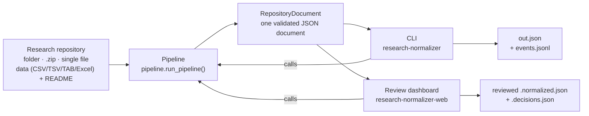
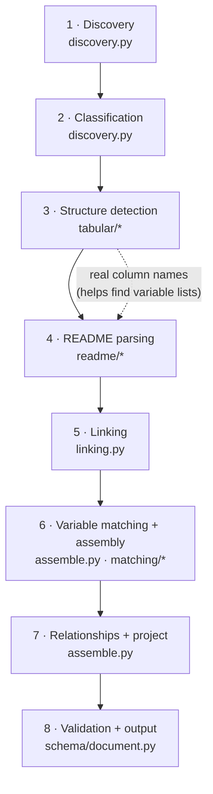
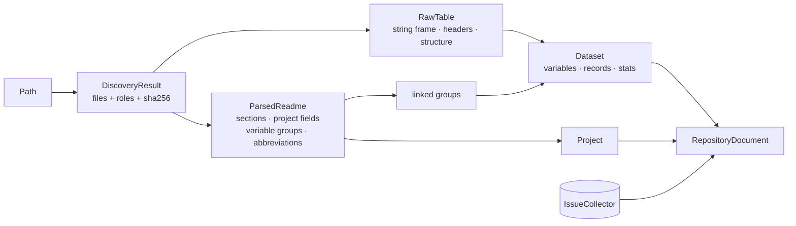
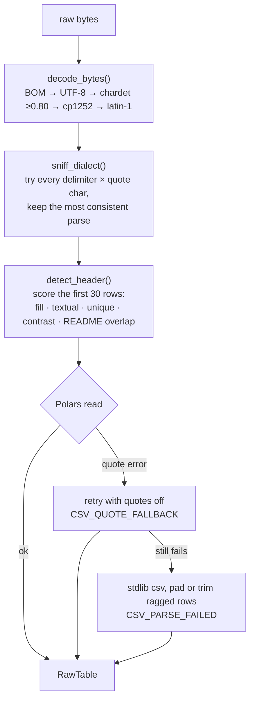
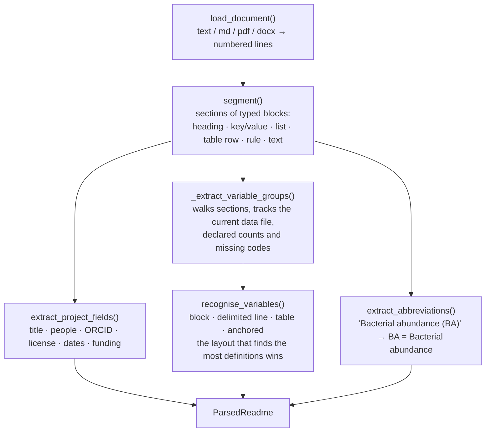
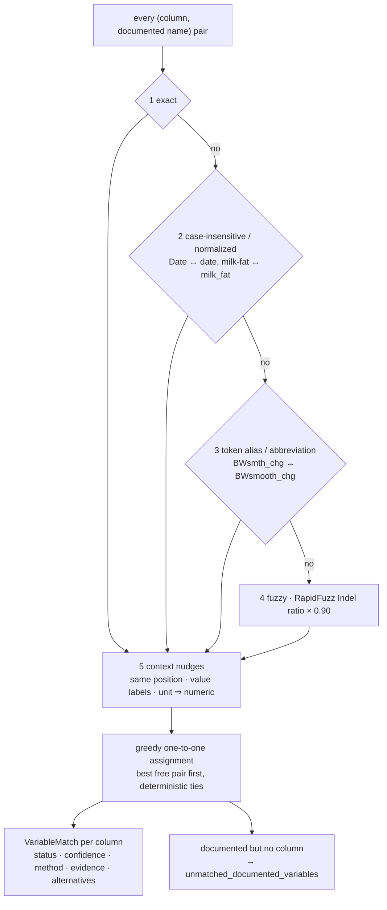
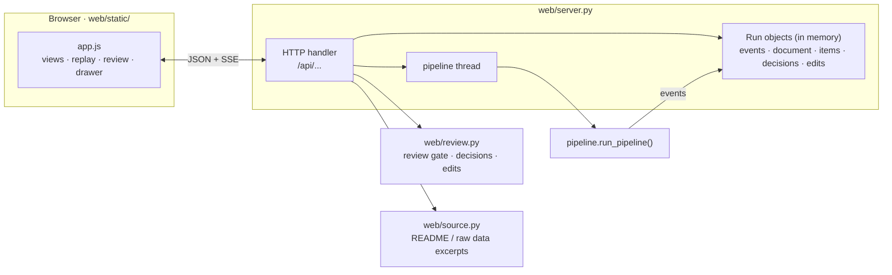
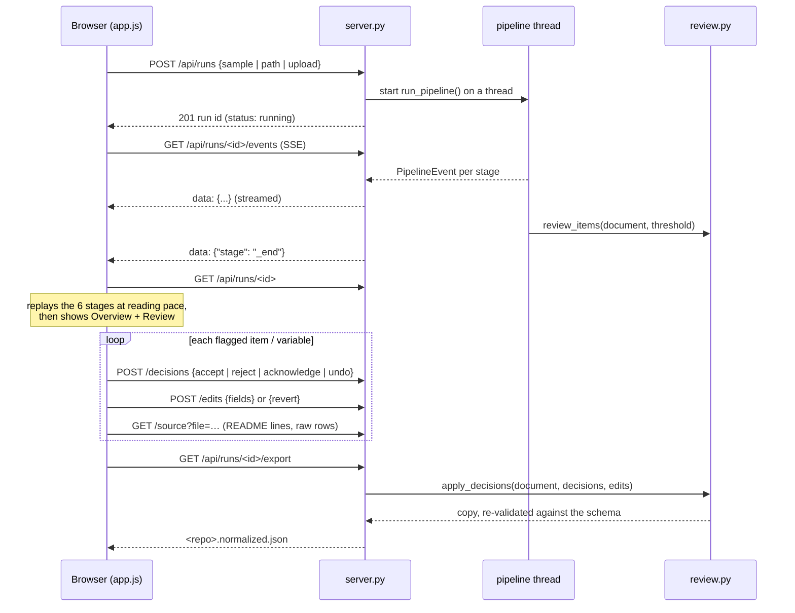

# Process map

How research-normalizer works end to end: what runs, in what order, which file does what, and how the files depend on each other. For the reasoning behind each decision, see [DESIGN.md](DESIGN.md).

## 1. The big picture

There are two ways in:

- **CLI** (`cli.py`): run once, write the JSON, print a summary.
- **Dashboard** (`web/`): run in the browser, watch the stages, review anything uncertain, fix variables, then export.

Both call the same `run_pipeline()`, so they always produce the same document.

## 2. The pipeline, stage by stage

`pipeline.py` is the only module that knows the stage order. Each stage reports progress as typed events (`events.py`) and records problems as issues (`issues.py`) instead of crashing. If one file breaks, the pipeline adds an `error` issue for it and moves on.

| # | Stage | What happens | Main files | In → out |
|---|---|---|---|---|
| 1 | Discovery | Walk the folder, or extract the zip safely (zip-slip and zip-bomb guards). Skip hidden and system files, enforce size and count limits, record a sha256 per file. | `discovery.py` | path → `DiscoveryResult` |
| 2 | Classification | Tag each file as `documentation`, `tabular` or `other`, by extension plus a content sniff. Unsupported files are skipped with an info issue. | `discovery.py` | files → `DiscoveredFile.role` |
| 3 | Structure detection | For each data file: decode (encoding ladder), sniff the delimiter and quote character, find the real header row, read every cell as a string. Excel yields one table per sheet. | `tabular/base.py`, `delimited.py`, `excel.py`, `dialect.py`, `header_detection.py`, `text_decoding.py` | `DiscoveredFile` → `RawTable` |
| 4 | README parsing | Load the text (txt/md/pdf/docx), split it into sections and blocks, pull out project fields (title, people, license, dates), variable definitions in any of 4 layouts, and abbreviations. | `readme/parser.py`, `loaders.py`, `segmenter.py`, `project_fields.py`, `variable_layouts.py`, `abbreviations.py` | path → `ParsedReadme` |
| 5 | Linking | Bind each README variable list to the data file it names, by file stem (`X.csv` in the README matches `X.tab` on disk). | `linking.py` | groups → per-file groups + global groups |
| 6 | Matching + assembly | For each table: infer column types, profile the values, match columns to documented variables (5 scoring steps), build typed records, attach provenance. | `assemble.py`, `matching/*`, `tabular/type_inference.py`, `tabular/profiling.py` | `RawTable` + groups → `Dataset` |
| 7 | Relationships + project | Find datasets that share columns; merge project metadata from all READMEs. | `assemble.py` | datasets, READMEs → `relationships`, `Project` |
| 8 | Validation + output | Build the Pydantic `RepositoryDocument`, which validates as it is built, with a summary and per-stage timings. | `schema/document.py`, `pipeline.py` | everything → `RepositoryDocument` |

Data files are read **before** READMEs on purpose: knowing the real column names lets the README parser recognise a variable list even when it has no "Variable List" heading.

### What each stage hands to the next

`IssueCollector` is passed through every stage, so the final document lists every problem with a severity, a plain message, a technical detail, a location and, where possible, a suggestion.

## 3. Inside the tricky stages

### 3a. Reading one data file (`tabular/delimited.py`)

Everything is read as strings. Missing values and types are decided later (`type_inference.py`), so a reader never silently turns `007` into `7` or `NA` into a number.

### 3b. Reading one README (`readme/parser.py`)

Every extracted value keeps its file and line range (`schema/provenance.py`). That's what the dashboard uses to highlight the exact README lines a description came from.

### 3c. Matching columns to documented variables (`matching/`)

| Confidence | Meaning |
|---|---|
| ≥ 0.85 | accepted |
| 0.70 – 0.85 | kept, with a `MATCH_LOW_CONFIDENCE` warning |
| < 0.70 | not linked; the column is undocumented |
| best and runner-up within 0.05 | `MATCH_AMBIGUOUS` |

The dashboard adds its own review gate on top of this (0.95 by default), so even accepted-but-imperfect matches can be checked by a person.

## 4. The review dashboard

`research-normalizer-web` starts a local server (stdlib only, localhost, **no authentication**) that serves the frontend in `web/static/` and a small JSON API.

### One run, from click to export

**What goes into the review queue** (`review.review_items`):

| Kind | When | Allowed decisions |
|---|---|---|
| `low_confidence` | matched, but confidence below the dashboard threshold | accept · reject |
| `ambiguous` | two README variables fit almost equally | accept · reject |
| `undocumented_column` | column with no README description | acknowledge |
| `phantom_variable` | documented in the README, missing from the data (e.g. `FRESH`) | acknowledge |

**How changes are applied.** The pipeline's document is never modified. Decisions and edits are stored next to it:

- `preview(doc, edits)` is what the browser sees: the document plus edits.
- `apply_decisions(doc, items, decisions, edits)` builds the export: decisions first, then edits (a hand fix always wins), then the summary is recomputed and the result re-validated.
- Editing a flagged variable resolves its review item automatically (`sync_auto_decisions`). Reverting the edit reopens it.
- "Acknowledge N notices" (`acknowledge_all`) clears only the items whose sole option is acknowledge. Uncertain and ambiguous matches always wait for a person.

### API

| Method | Path | Purpose |
|---|---|---|
| GET | `/api/samples` | sample repositories in `./samples` |
| GET / POST | `/api/runs` | list runs / start one |
| GET / DELETE | `/api/runs/<id>` | full run / forget it (and its uploads) |
| GET | `/api/runs/<id>/events` | live progress (Server-Sent Events) |
| POST | `/api/runs/<id>/decisions` | record or undo a review decision |
| POST | `/api/runs/<id>/acknowledge-all` | acknowledge every pending notice; never accepts a match |
| POST | `/api/runs/<id>/edits` | correct a variable, or revert it |
| GET | `/api/runs/<id>/source` | read-only excerpt of an original file |
| GET | `/api/runs/<id>/export[?log=1]` | reviewed JSON, or the decision log |
| POST / PUT | `/api/uploads[/<id>?path=]` | stage dropped files for a run |

Runs live in memory and disappear when the server stops.
